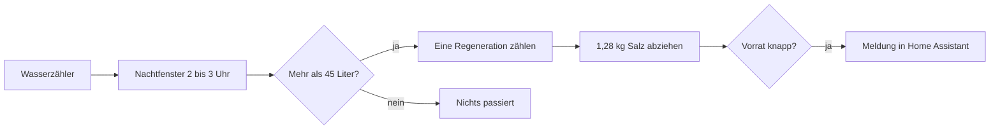

# Funktionsweise

Diese Seite erklärt, **was die Integration tut und warum**, ohne Programmierkenntnisse. Wer es genauer wissen will, findet den Aufbau unter [Technische Dokumentation](Technische-Dokumentation).

## Das Problem

Eine Enthärtungsanlage braucht Regeneriersalz. Sie zeigt aber meist nicht an, **wie viel Salz noch da ist** und **wie oft sie schon regeneriert hat**. Nachsehen heißt in den Keller gehen und in den Behälter schauen. Vergisst man es, wird das Wasser wieder hart.

## Die Idee

Die Anlage verrät sich durch ihren **Wasserverbrauch**: Während einer Regeneration spült sie und verbraucht dabei rund 52 Liter. Das passiert nachts, in einem bekannten Zeitfenster. Ein Wasserzähler, der ohnehin in Home Assistant läuft, sieht diesen Verbrauch.

Die Integration zählt also nicht „im Gerät“, sondern **beobachtet von außen**:

1. Sie erkennt Regenerationen am Wasserverbrauch in der Nacht.
2. Sie rechnet mit, wie viel Salz dabei verbraucht wurde.
3. Sie meldet sich, bevor das Salz ausgeht.

## 1. Regenerationen erkennen

**Das Zeitfenster.** Du legst fest, wann die Anlage regeneriert (Standard: 2 bis 3 Uhr, immer volle Stunden). Nur Wasser, das in diesem Fenster durch den Zähler läuft, zählt.

**Der Schwellwert.** Du legst fest, ab wie viel Wasser es eine Regeneration war (Standard: 45 Liter). Entscheidend ist: Es muss **mehr als** der Schwellwert sein, nicht „mindestens“. Die Anlage verbraucht 52–53 Liter, der Schwellwert liegt mit 45 Litern deutlich darunter. Ein paar Liter Spülung der Toilette in der Nacht (typisch 6–9 Liter) bleiben darunter und lösen nichts aus.

**Die Auswertung.** Eine Minute nach Ende des Fensters (also um 3:01 Uhr) wird zusammengezählt. Die eine Minute Nachlauf sorgt dafür, dass auch späte Zählerwerte noch ins Fenster fallen.

### Beispiel einer Nacht

Der Wasserzähler zeigt (in Litern, kumulierter Stand):

| Uhrzeit | Zählerstand | Zuwachs | Summe im Fenster |
|---|---|---|---|
| 22:00 | 1000 | – | (Fenster noch nicht offen) |
| 02:05 | 1010 | +10 | 10 |
| 02:20 | 1030 | +20 | 30 |
| 02:40 | 1050 | +20 | 50 ← **Schwelle überschritten** |
| 02:55 | 1052 | +2 | 52 |
| 03:01 | | | **Auswertung: 52 > 45 → eine Regeneration** |

Als Zeitpunkt der Regeneration wird **02:40 Uhr** festgehalten (der Moment, in dem die Schwelle überschritten wurde). Zusätzlich merkt sich die Integration die 52 Liter als „Verbrauch im Zeitfenster“.

Hätte nur jemand nachts 20 Liter Wasser gezapft, läge die Summe bei 20, und es würde **keine** Regeneration gezählt.

### Was ist mit dem Zählerstand selbst?

Die Integration braucht den **kumulierten Zählerstand** (der nur steigt), nicht den Durchfluss. Sie rechnet selbst aus, wie viel zwischen zwei Meldungen dazugekommen ist. Zählerstände in Litern oder Kubikmetern werden verstanden.

## 2. Den Salzbestand rechnen

Du gibst zwei Zahlen vor:

- **Behältergröße**: wie viel Kilogramm Salz passen in den Behälter (Standard 25 kg).
- **Salzverbrauch pro Regeneration**: wie viel eine Regeneration verbraucht (Standard 1,28 kg).

Bei jeder erkannten Regeneration sinkt der rechnerische Bestand um diese Menge. Daraus entstehen drei Werte:

| Wert | Rechnung | Beispiel bei 25 kg und 1,28 kg |
|---|---|---|
| Salzbestand (kg) | Behältergröße − verbrauchte Menge | nach 10 Regenerationen: 25 − 12,8 = **12,2 kg** |
| Salzfüllstand (%) | Bestand ÷ Behältergröße | 12,2 ÷ 25 = **49 %** |
| Restbestand (Regenerationen) | Bestand ÷ Verbrauch, **abgerundet** | 12,2 ÷ 1,28 = 9,5 → **9** |

Der Bestand ist **rein rechnerisch**. Er ersetzt keinen Blick in den Behälter, ist aber nach jedem Nachfüllen wieder genau, wenn du die Menge richtig angibst.

Aus einem vollen Behälter von 25 kg reichen **19 Regenerationen** (25 ÷ 1,28 = 19,5, abgerundet).

## 3. Die Warnung

Die Integration warnt, wenn der **Restbestand** die Warnschwelle erreicht (Standard: **3 Regenerationen**). Das heißt: Das Salz reicht nur noch für höchstens 3 Regenerationen.

Im Beispiel passiert das nach der **16. Regeneration** (Bestand 4,52 kg, Restbestand 3). Nach der 15. sind es noch 5,8 kg und 4 Regenerationen, da ist noch Ruhe.

Dann geschieht dreierlei:

- Eine **Meldung** („Salz nachfüllen“) erscheint in Home Assistant (Glocke in der Seitenleiste).
- Der Binärsensor **„Salz nachfüllen“** geht an. Den kannst du für Benachrichtigungen aufs Handy nutzen.
- Die Meldung **bleibt**, bis du das Nachfüllen bestätigst *und* der Bestand danach wieder über der Warnschwelle liegt.

## 4. Nachfüllen bestätigen

Die Integration kann nicht sehen, dass du Salz eingefüllt hast. Du sagst es ihr, und zwar **mit der Menge in Kilogramm**. Das ist Absicht: Weil bei dieser Anlage meist **nicht der ganze Sack auf einmal hineinpasst**, füllst du oft in zwei Schritten nach. Jede Menge wird zum Bestand **addiert**, höchstens bis zur Behältergröße.

**Beispiel:** Warnung bei 4,52 kg.

1. Du füllst 20 kg ein und trägst **20** ein → Bestand 24,52 kg, Restbestand 19. Die Warnung endet, denn jetzt ist wieder reichlich Salz da.
2. Ein paar Tage später passt der Rest des Sacks hinein, du trägst **5** ein → rechnerisch 29,52 kg, begrenzt auf **25 kg (voll)**.

Der Zähler **„Regenerationen seit Nachfüllen“** springt erst auf 0, wenn der Behälter danach **voll** ist, also im Beispiel erst bei Schritt 2. Bei Schritt 1 läuft er weiter, denn der Behälter war nicht voll.

Ist der Behälter ganz voll, gibt es die Abkürzung: die Taste **„Behälter voll“**. Ein Druck genügt, ohne Mengenangabe.

Was bewusst **nicht** geht: Das Nachfüllen ohne Mengenangabe bestätigen. Die Taste „Salz nachgefüllt“ tut bei Menge 0 nichts und zeigt eine Fehlermeldung.

## 5. Die Hygiene-Regel (7 Tage)

Die Anlage regeneriert **spätestens 7 Tage nach der letzten Regeneration**, auch wenn kaum Wasser verbraucht wurde. Das dient der Hygiene.

Die Integration nutzt das als Kontrolle:

- Der Sensor **„Nächste Regeneration spätestens“** zeigt, bis wann die nächste fällig ist (7 Tage nach der letzten Regeneration, zu Beginn des Zeitfensters).
- Ist dieser Tag vorbei und **wurde keine Regeneration erkannt**, geht der Binärsensor **„Regeneration überfällig“** an, und eine Meldung erscheint.

Mögliche Gründe für „überfällig“: Der Wasserzähler war in der Nacht nicht verfügbar, die Zählerwerte kamen nicht rechtzeitig an, oder die Anlage hat ein Problem. Hat die Anlage tatsächlich regeneriert, trägst du die Regeneration mit dem Dienst `add_regeneration` nach. Die Integration zählt sie **nicht von selbst** nach, weil sie nicht wissen kann, ob die Anlage wirklich lief.

Rechnerisch heißt die Hygiene-Regel: Auch bei sehr wenig Verbrauch fällt mindestens eine Regeneration pro Woche an. Ein voller Behälter reicht dann etwa **19 Wochen**.

## 6. Was bei Störungen passiert

| Situation | Verhalten |
|---|---|
| **Home Assistant wird neu gestartet** | Zähler und Bestand bleiben erhalten. War ein Zeitfenster inzwischen zu Ende, wird es nachträglich ausgewertet. Nach dem Start wird nur ein neuer Bezugswert gesetzt; was der Zähler währenddessen zählte, geht nicht ins Fenster ein. |
| **Wasserzähler „nicht verfügbar“** | Danach wird nur ein neuer Bezugswert gesetzt. Der Verbrauch dazwischen wird bewusst **nicht** gezählt, damit keine falschen Regenerationen entstehen. |
| **Zähler zurückgesetzt oder getauscht** (Stand sinkt) | Der negative Sprung wird ignoriert. |
| **Im Fenster kommt gar kein Zählerwert** | Das Fenster wird mit 0 Litern abgeschlossen: keine Regeneration. |
| **Behältergröße wird kleiner eingestellt** | Der Bestand wird auf die neue Größe begrenzt. |
| **Salz wird „negativ“** | Geht nicht: Der Bestand sinkt höchstens bis 0 kg. |

## 7. Zustand von Hand eintragen (ab Version 1.2.0)

Die Integration kennt nur, was sie selbst beobachtet hat. Richtest du sie **mitten in einer Füllung** ein, fehlt ihr die Vorgeschichte: Wann hat die Anlage zuletzt regeneriert? Wie oft seit dem letzten Füllen? Beides kannst du von Hand eintragen:

- **Letzte Regeneration korrigieren**: der Zeitpunkt der letzten Regeneration, zum Beispiel vom Display der Anlage. Er bestimmt „Nächste Regeneration spätestens“ und „Regeneration überfällig“. Es wird dabei **keine** Regeneration gezählt, Zähler und Salzbestand bleiben unverändert. Der Zeitpunkt darf nicht in der Zukunft liegen.
- **Regenerationen seit Nachfüllen korrigieren**: wie viele Regenerationen seit dem letzten Füllen bis voll vergangen sind. Daraus wird der Salzbestand **neu berechnet**: Behältergröße − Anzahl × Salzverbrauch pro Regeneration. Der Gesamtzähler wird bei Bedarf auf mindestens diese Anzahl angehoben.

**Beispiel:** Behälter 25 kg, 1,28 kg je Regeneration. Die Anlage hat seit dem letzten Füllen 12 Mal regeneriert. Du trägst 12 ein. Bestand: 25 − 12 × 1,28 = **9,64 kg**, Restbestand 7. Die Warnung steht damit schon im Blick, und du siehst früh, wann nachzufüllen ist.

Beides gibt es als Eingabefelder am Gerät und als Dienste (siehe [Entitäten und Dienste](Entitaeten-und-Dienste)).

## Grenzen im Überblick

- Die Erkennung ist eine **Näherung** über den Wasserverbrauch. Verbraucht nachts jemand viel Wasser im Zeitfenster, kann das fälschlich als Regeneration zählen. Mehr dazu unter [Fehlersuche und Grenzen](Fehlersuche-und-Grenzen).
- Der Salzverbrauch pro Regeneration gilt als **konstant**.
- Das Zeitfenster darf **nicht über Mitternacht** gehen.
