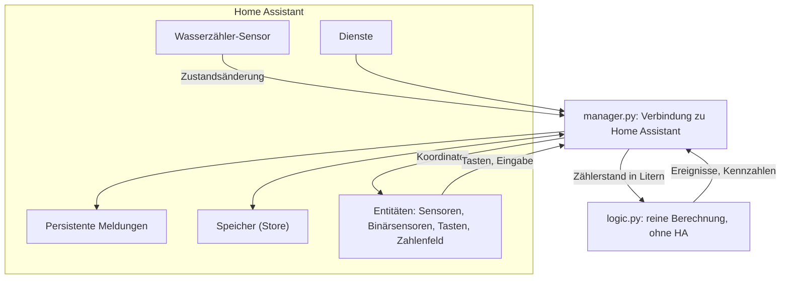

# Technische Dokumentation

Für alle, die den Code verstehen, prüfen oder ändern wollen. Das Verhalten aus Nutzersicht steht unter [Funktionsweise](Funktionsweise).

## Überblick

| Eigenschaft | Wert |
|---|---|
| Domain | `water_softener_refill_sensor` |
| Typ | Home-Assistant-Integration (`integration_type: service`, `iot_class: calculated`) mit Einrichtung über die Oberfläche (`config_flow`) |
| Plattformen | `sensor`, `binary_sensor`, `button`, `number`, `datetime` |
| Abhängigkeiten | keine (`requirements: []`) |
| Mindestversion | Home Assistant 2024.12 |
| Verteilung | HACS, Kategorie *Integration* |
| Sprachen | Deutsch, Englisch |

Die Integration ruft **keine Geräte und keine Cloud** ab. Sie beobachtet einen vorhandenen Sensor und rechnet.

## Aufbau

Die Berechnung ist **bewusst von Home Assistant getrennt**, damit sie ohne Home Assistant getestet werden kann.

| Datei | Zweck |
|---|---|
| `logic.py` | **Reine Logik ohne Home-Assistant-Importe**: Zeitfenster, Erkennung, Salzbestand, Hygieneregel, (De-)Serialisierung |
| `manager.py` | Verbindet die Logik mit Home Assistant: Zähler beobachten, Zeitplan, Speicher, Meldungen, Koordinator |
| `__init__.py` | Einstieg: Setup, Unload, Remove des Eintrags; Registrierung der Dienste |
| `config_flow.py` | Einrichtung und Optionen (Formulare, Validierung) |
| `const.py` | Schlüssel, Standardwerte, Kennungen von Speicher und Meldungen |
| `entity.py` | Gemeinsame Basisklasse: Gerät, eindeutige ID, Übersetzungsname |
| `sensor.py`, `binary_sensor.py`, `button.py`, `number.py` | Die Entitäten |
| `services.yaml` | Beschreibung der Dienste für die Oberfläche |
| `translations/de.json`, `en.json` | Alle Texte (immer gemeinsam pflegen) |
| `manifest.json` | Metadaten, Versionsnummer |

## Datenfluss

1. **Zählerstand kommt an.** `manager.py` hört mit `async_track_state_change_event` auf den Wasserzähler. Jeder neue Zustand wird in **Liter** umgerechnet (L, ℓ, Liter = 1; m³, m3 = 1000; ml = 0,001) und an `SoftenerModel.on_meter` übergeben. Als Zeitpunkt gilt `last_updated` des Zustands in Ortszeit.
2. **Zuwachs berechnen.** `on_meter` bildet die Differenz zum vorigen Wert. Nur **positive** Zuwächse **innerhalb des Zeitfensters** werden addiert. Überschreitet die Summe zum ersten Mal den Schwellwert, merkt sich das Modell diesen Zeitpunkt (`window_crossed_at`).
3. **Auswertung.** Um `Ende des Fensters + 1 Minute` (Standard 03:01:00) löst `async_track_time_change` die Auswertung aus. Ist die Summe **größer als** der Schwellwert, wird eine Regeneration registriert: Zähler erhöhen, Salz abziehen, Zeitpunkt und Verlauf aktualisieren. Das Fenster gilt danach als ausgewertet (`evaluated_date`).
4. **Veröffentlichen.** Der Manager baut einen Schnappschuss (`snapshot()`) und gibt ihn mit `coordinator.async_set_updated_data` an alle Entitäten weiter. Es gibt **kein Polling**, nur Push.
5. **Meldungen.** Nach jedem relevanten Schritt werden beide Meldungen neu bewertet: anlegen, wenn die Bedingung zutrifft, sonst entfernen.
6. **Speichern.** Der Zustand wird verzögert (30 Sekunden) über `Store.async_delay_save` gesichert, beim Entladen sofort.

## Manuelle Eingriffe

Alle Eingriffe (Tasten, Eingaben, Dienste) laufen über den Manager und enden in `_after_manual_change()`: Meldungen neu bewerten, Schnappschuss veröffentlichen, Zustand verzögert speichern.

| Eingriff | Wirkung im Modell (`logic.py`) |
|---|---|
| `refill(kg)` | Bestand + kg, höchstens bis `capacity_kg`; Zähler seit Nachfüllen nur bei vollem Behälter auf 0 |
| `refill_full()` | Bestand = `capacity_kg`, Zähler seit Nachfüllen 0 |
| `set_stock(kg)` | Bestand = kg (begrenzt) |
| `add_manual_regeneration(at, count)` | Je Regeneration wie eine erkannte (`_register`), Zeitpunkt = jetzt |
| `set_last_regeneration(at, now)` | `last_regen_at = at`; `ValueError`, wenn `at` in der Zukunft liegt. Keine Zähler- und Bestandsänderung |
| `set_regens_since_refill(count)` | Zähler = count; Bestand = Behältergröße − count × Verbrauch (begrenzt); Gesamtzähler = max(Gesamtzähler, count); `ValueError` bei negativer Zahl |

Der Manager übersetzt `ValueError` des Modells in `ServiceValidationError`.

## Ereignisse und Randfälle

| Fall | Umsetzung |
|---|---|
| Start von Home Assistant | Zustand laden, ein inzwischen beendetes Zeitfenster **nachträglich** auswerten, aktuellen Zählerstand nur als **Bezugswert** übernehmen (`baseline_only`) |
| Zähler „nicht verfügbar“ / „unbekannt“ | Merker `_need_baseline`: der nächste gültige Wert setzt nur den Bezugswert |
| Zählerstand sinkt (Reset, Tausch) | Differenz ≤ 0 wird nicht gezählt |
| Nicht-numerischer Zustand | wird ignoriert |
| Unbekannte Einheit | Warnung einmalig, Annahme Liter |
| Kein Zählerwert im Fenster | Planmäßige Auswertung (`scheduled=True`) schließt das Fenster mit 0 Litern ab |
| Mehrere Zählerwerte im Fenster | Zuwächse werden aufaddiert |
| Behältergröße verkleinert | Bestand wird bei jedem Laden auf `capacity_kg` begrenzt |
| Bestand ≤ 0 | `_clamp` hält den Bestand bei mindestens 0 |
| Nachfüllen über die Behältergröße | Begrenzung auf `capacity_kg`, Warnung im Protokoll |
| Gleitkommafehler | Bestand wird bei Rechnungen auf 4 Stellen gerundet; Restbestand mit kleiner Toleranz abgerundet |

### Die 7-Tage-Regel

`next_regen_due` = Datum der letzten Regeneration + 7 Tage, zu Beginn des Zeitfensters. `regen_overdue` ist wahr, sobald **jetzt ≥ Ende des Fensters (inklusive Nachlauf) am Fälligkeitstag**. Es zählt nur, wenn mindestens eine Regeneration bekannt ist. Die Regel **erzeugt keine** Regeneration, sie meldet nur.

## Zustand und Speicherformat

Ablage: Home Assistants `Store`, Schlüssel `water_softener_refill_sensor.<Eintrags-ID>`, Version 1. Inhalt (JSON):

| Feld | Typ | Bedeutung |
|---|---|---|
| `stock_kg` | Zahl | Rechnerischer Bestand |
| `total_regens` | Ganzzahl | Alle Regenerationen |
| `regens_since_refill` | Ganzzahl | Regenerationen seit dem letzten vollen Behälter |
| `last_value_l` | Zahl oder null | Letzter Zählerstand (Bezugswert) in Litern |
| `window_date` | Datum oder null | Tag des laufenden oder zuletzt erfassten Fensters |
| `window_usage_l` | Zahl | Summe im Fenster |
| `window_crossed_at` | Zeitstempel oder null | Moment des Überschreitens |
| `evaluated_date` | Datum oder null | Letztes ausgewertetes Fenster |
| `last_regen_at` | Zeitstempel oder null | Letzte Regeneration |
| `last_refill_at` | Zeitstempel oder null | Letztes Nachfüllen |
| `history` | Liste von Zeitstempeln | Letzte 10 Regenerationen, neueste zuerst |

**Regel für Änderungen:** Das Format nicht brechen. Neue Felder bekommen in `State` und `from_dict` einen Standardwert, damit ältere Speicherstände lesbar bleiben.

**Nicht gespeichert:** die Eingabe „Nachgefüllte Salzmenge“ (`refill_input_kg`, nur im Speicher des Managers).

## Entitäten

- Alle erben von `EnthaertungEntity` (`CoordinatorEntity`), mit `has_entity_name` und Namen über den `translation_key`.
- Eindeutige ID: `<Eintrags-ID>_<Schlüssel>`.
- Geräteinformation: Kennung `(Domain, Eintrags-ID)`, Name = Titel des Eintrags, Typ *Service*.
- Sensoren sind als Beschreibungen in `sensor.py` (`SENSORS`) definiert, jede mit einer Funktion `value_fn`, die ihren Wert aus dem Schnappschuss liest.
- Die Tasten und das Zahlenfeld rufen Methoden des Managers auf (`async_refill`, `async_refill_full`, `set_refill_input`).

## Dienste

Registriert in `async_setup` (einmal je Home Assistant, nicht je Eintrag), mit `voluptuous`-Schemas:

| Dienst | Schema |
|---|---|
| `refill` | `kg`: Pflicht, Zahl > 0 |
| `set_salt_stock` | `kg`: Pflicht, Zahl ≥ 0 |
| `add_regeneration` | `count`: optional, Ganzzahl 1–100, Standard 1 |
| `set_last_regeneration` | `datetime`: Pflicht, nicht in der Zukunft; ohne Zeitzone gilt Ortszeit (ab 1.2.0) |
| `set_regenerations_since_refill` | `count`: Pflicht, Ganzzahl 0–1000 (ab 1.2.0) |

Alle akzeptieren optional `config_entry`. Fehler (unbekannter Eintrag, keiner oder mehrere eingerichtet, Menge fehlt) werden als `ServiceValidationError` gemeldet.

## Einrichtung und Optionen

`config_flow.py` hat einen Einrichtungsschritt und einen Optionsfluss. Beide teilen sich Schema und Prüfung:

- Zahlenfelder kommen als Kommazahlen an und werden in passende Typen umgewandelt (`_normalize`).
- Prüfungen (`_validate`): Beginn des Fensters < Ende; Verbrauch pro Regeneration ≤ Behältergröße; Anfangsbestand ≤ Behältergröße.
- Die Optionen überlagern die Einrichtungsdaten (`{**data, **options}`). Ein Update-Listener lädt den Eintrag nach einer Änderung neu.

## Bekannte Risiken

- **Attrappen ersetzen keine echte Instanz.** Die Tests nutzen Attrappen (`tests/ha_stubs.py`). Sie prüfen den eigenen Ablauf, nicht die Kompatibilität mit der echten API. Das zeigte sich in Version 1.1.0: Ein Formularfeld ohne Einheit übergab Home Assistant eine leere Einheit, die Einrichtung scheiterte mit „400: Bad Request“. Die Attrappen hatten das nicht bemerkt. Seit 1.1.1 übergeben Felder ohne Einheit keine Einheit mehr, und ein Test erkennt leere Einheiten in Formularen. Einrichtung, Optionen, Entitäten, Tasten und Dienste wurden laut Änderungsprotokoll mit Home Assistant 2026.2 geprüft.
- Die Erkennung beruht auf dem Wasserverbrauch (siehe [Fehlersuche und Grenzen](Fehlersuche-und-Grenzen)).
